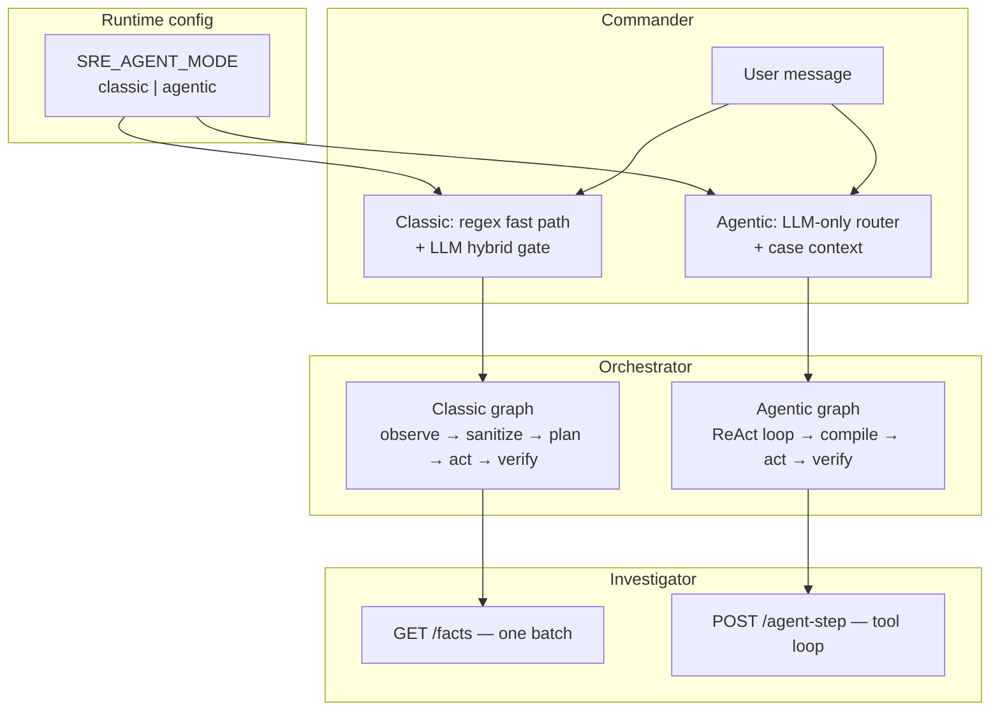
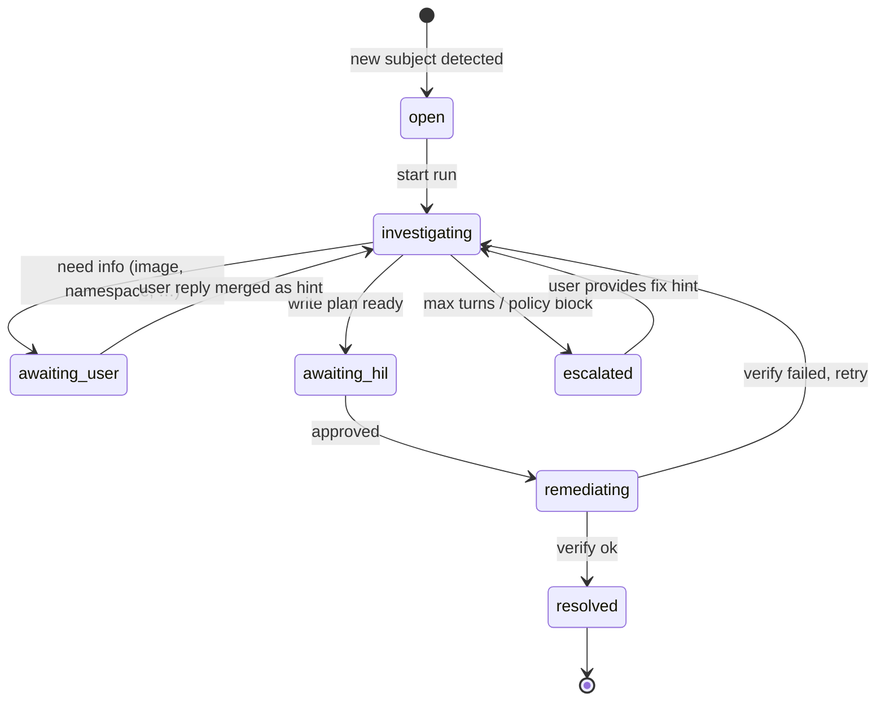
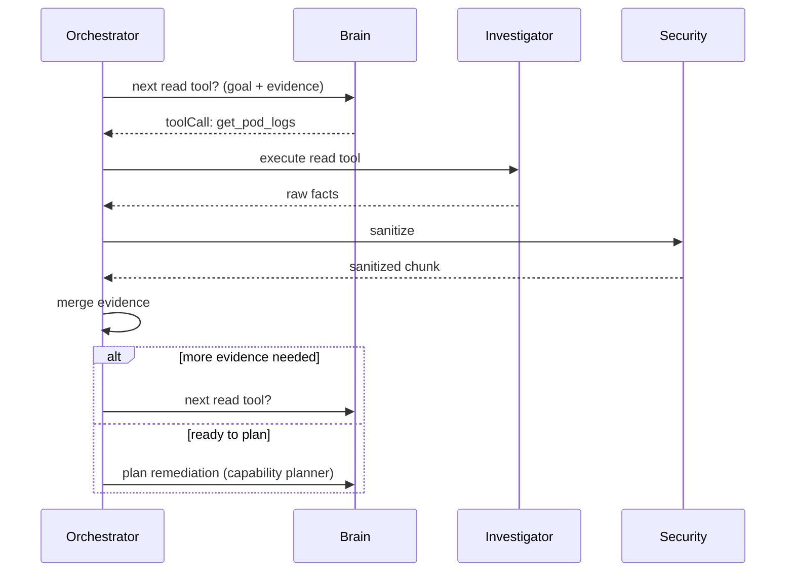

# Agent Mode Design — Classic vs LLM-Driven Flow

Design for **case continuity**, an **investigator tool loop**, and a **configurable dual-mode** runtime: keep today’s deterministic pipeline as default, or opt into a full LLM-driven agent loop when desired.

Related: [ARCHITECTURE.md](./ARCHITECTURE.md) · [TOOL-COMPILER-ROADMAP.md](./TOOL-COMPILER-ROADMAP.md) · [CONVERSATIONAL-UX-ROADMAP.md](./CONVERSATIONAL-UX-ROADMAP.md) · [HOLMES-COMPARISON-AND-ADOPTION.md](./HOLMES-COMPARISON-AND-ADOPTION.md) · [PRODUCT-ROADMAP.md](./PRODUCT-ROADMAP.md)

**Status:** Implemented (Phase A–D). Enable with `SRE_AGENT_MODE=agentic`.

---

## 1. Problem statement

Today the platform feels **scripted** because:

| Layer | Classic behavior | User impact |
|-------|------------------|-------------|
| **Commander** | Regex fast path + many `try*FollowUp` handlers | Follow-ups misroute; each message re-parsed in isolation |
| **Investigator** | One `GET /facts` batch per run | Over-gathers or under-gathers; no “fetch logs next” |
| **Orchestrator** | Fixed LangGraph: observe → plan once → act | No adaptive investigation |
| **Brain** | Single `/plan-only` call on sanitized facts | LLM used in two short bursts, not as an agent |

The **coding agent** (CI-2) already proves a multi-turn tool loop works. This design extends that pattern to cluster investigation and chat — behind a **mode switch**.

---

## 2. Design principle (unchanged for both modes)

```text
LLM never gets raw cluster API access or ungated writes.
All side effects go through typed tools → security → policy → HIL → verify.
```

**Agentic mode** changes *who decides the next step* (LLM vs fixed graph). It does **not** remove guardrails.

---

## 3. Dual-mode overview



| Mode | Best for | Tradeoff |
|------|----------|----------|
| **`classic`** (default) | Production, predictable SRE ops, low cost/latency | Feels scripted; brittle follow-ups |
| **`agentic`** | Dev/staging, complex RCA, conversational fix loops | Higher token cost; needs tuning + caps |

Per-tenant or per-channel override is supported (see §8).

---

## 4. Configuration

### 4.1 Master switch

| Variable | Default | Values | Scope |
|----------|---------|--------|-------|
| `SRE_AGENT_MODE` | `classic` | `classic` \| `agentic` | Global default |

Compose example:

```yaml
orchestrator-agent:
  environment:
    SRE_AGENT_MODE: classic   # or agentic
commander-agent:
  environment:
    SRE_AGENT_MODE: classic
brain-agent:
  environment:
    SRE_AGENT_MODE: classic
investigator-agent:
  environment:
    SRE_AGENT_MODE: classic
```

All services read the same value at startup; orchestrator is authoritative for run execution mode (stored on the run record).

### 4.2 Mode-specific toggles (inherit from master)

| Variable | Classic default | Agentic default | Meaning |
|----------|-----------------|-----------------|---------|
| `COMMANDER_ROUTING_MODE` | `hybrid` | `llm_only` | `hybrid` \| `llm_only` \| `regex_only` |
| `INVESTIGATE_GATHER_MODE` | `batch` | `tool_loop` | `batch` \| `tool_loop` |
| `ORCHESTRATOR_GRAPH_MODE` | `fixed` | `react` | `fixed` \| `react` |
| `USE_CAPABILITY_PLANNER` | `false` | `true` | LLM picks tool pipeline vs action enum |
| `AGENTIC_LLM_TOOL_SELECT` | `false` | `true` | Brain uses LLM for next read tool |
| `AGENTIC_LLM_REFLECT` | `false` | `true` | Brain uses LLM after verify failure |

When `SRE_AGENT_MODE=agentic`, unset sub-vars use the **agentic** column. Explicit sub-vars override (allows e.g. agentic investigate + classic commander routing during migration).

### 4.3 Agentic safety caps

| Variable | Default | Purpose |
|----------|---------|---------|
| `AGENTIC_MAX_TURNS` | `12` | Max LLM↔tool iterations per run |
| `AGENTIC_MAX_READ_TOOLS` | `20` | Max read-only tool calls per run |
| `AGENTIC_BUDGET_TOKENS` | `80000` | Soft stop; escalate when exceeded |
| `AGENTIC_REQUIRE_HIL_WRITES` | `true` | All `gitops.*` / `executor.*` writes need HIL in prod |
| `AGENTIC_ALLOWED_READ_TOOLS` | `*` | Comma list or `*` for registry subset |

### 4.4 Health / visibility

`GET /health` on commander and orchestrator returns:

```json
{
  "agentMode": "classic",
  "routingMode": "hybrid",
  "investigateGatherMode": "batch",
  "graphMode": "fixed"
}
```

Console chat header shows mode badge when `agentic` (optional UX).

---

## 5. Case model (shared by both modes)

A **case** is the durable thread of work on one subject — not a new incident per chat message.

### 5.1 Case object

```typescript
interface AgentCase {
  caseId: string;                    // uuid, stable across follow-ups
  subject: {
    kind: 'workload' | 'namespace' | 'cluster' | 'ci' | 'deploy';
    namespace?: string;
    resourceName?: string;
    resourceKind?: ResourceKind;
    githubRepo?: string;
    label: string;                   // user-facing, e.g. "frappe-operator-controller-manager"
  };
  status: 'open' | 'investigating' | 'awaiting_user' | 'awaiting_hil' | 'remediating' | 'resolved' | 'escalated';
  activeRunId?: string;
  lastIncidentId?: string;
  /** Accumulated evidence — grows in agentic mode, snapshot in classic */
  evidence: {
    facts?: Partial<DiagnosisContext>;
    rcaPointers?: RcaPointers;
    userHints: string[];             // e.g. "set image to ghcr.io/vyogotech/frappe-operator:latest"
    actionAttempts: ActionRecord[];
  };
  platform: Platform;
  channelId: string;
  userId: string;
  createdAt: string;
  updatedAt: string;
}
```

**Storage:** Redis (`sre:case:{platform}:{channelId}:{userId}:{caseId}`) + index by subject key for dedup.

### 5.2 Case lifecycle



### 5.3 Commander integration

| Event | Classic (today) | With case (both modes) |
|-------|-----------------|------------------------|
| User: "fix frappe-operator" | New `incidentId` | Open or resume case by subject |
| User: "use ghcr image …" | Regex follow-up handlers | Append `userHints[]`, resume case run |
| User: "what's the status?" | `tryStatusFollowUp` | Read case.status + active run |
| Run completes | Session flags only | Update case.status + evidence |

**Classic mode** still creates cases for session continuity but uses batch facts + fixed graph. **Agentic mode** uses the full case evidence accumulator and tool loop.

---

## 6. Classic mode (existing pipeline)

No behavior change when `SRE_AGENT_MODE=classic`. Documented here as the baseline.

```text
User → commander (hybrid routing) → POST /runs
     → orchestrator fixed graph
     → investigator GET /facts (one batch)
     → security sanitize
     → brain POST /plan-only (single shot)
     → authorize → policy → HIL → act → verify
     → commander narrate
```

**Improvements that apply in classic too (Phase 1):**

- Case object for follow-up binding (replaces most `try*FollowUp` handlers)
- Resume run on user hint instead of new incident
- `USE_CAPABILITY_PLANNER=true` optional without full agentic mode

---

## 7. Agentic mode — LLM-driven flow

### 7.1 Commander — LLM-only routing

When `COMMANDER_ROUTING_MODE=llm_only`:

1. Skip regex fast path except explicit slash-commands (`/deploy`, `/help`).
2. Single LLM call with: user message + transcript + **active case** + last run outcome.
3. LLM returns structured intent:

```typescript
interface AgentRouteDecision {
  action: 'start_run' | 'resume_case' | 'reply' | 'clarify' | 'cancel_case';
  caseId?: string;
  runRequest?: Partial<StartRunRequest>;
  userHint?: string;           // merged into case.evidence.userHints
  reply?: string;
  clarifyPrompt?: string;
}
```

4. No `tryStatusFollowUp`, `tryImageUpdateFollowUp`, etc. — the LLM uses case context.

**Fallback:** If LLM unavailable, degrade to `hybrid` for that request only (log warn).

### 7.2 Investigator — tool loop

New endpoint: `POST /agent-step`

```typescript
interface AgentStepRequest {
  caseId: string;
  incidentId: string;
  runId: string;
  goal: string;                          // from case.subject + user message
  evidence: AgentCase['evidence'];
  priorSteps: AgentStepRecord[];
  allowedTools: ReadToolName[];          // subset of registry
}

interface AgentStepResponse {
  done: boolean;                         // true when enough evidence to plan
  toolCall?: ReadToolCall;               // next read tool to execute
  summary?: string;                      // interim narrative for chat progress
  mergedEvidence?: Partial<DiagnosisContext>;
}
```

**Read tools** (initial catalog — extend via registry):

| Tool name | Description |
|-----------|-------------|
| `investigator.get_workload` | Deployment/STS facts, container statuses |
| `investigator.get_events` | Recent events for workload/namespace |
| `investigator.get_pod_logs` | Current/previous logs (excerpt, size-capped) |
| `investigator.get_cluster_health` | Cluster-wide summary |
| `investigator.get_namespace_health` | Namespace summary |
| `investigator.observability_logs` | Loki / pod log merge (existing PLAT-4a) |
| `investigator.observability_metrics` | PromQL bundle (existing PLAT-4b) |
| `investigator.repo_inspect` | Git manifest read (existing) |

Brain chooses the next read tool; orchestrator executes it; sanitized result appended to `evidence`; repeat until `done` or cap hit.



### 7.3 Orchestrator — ReAct graph (LangGraph nodes)

When `INVESTIGATE_GATHER_MODE=tool_loop`, investigation is **graph-driven** — no imperative while-loops:

```text
START
  → agentDecide          ← Brain LLM picks next read tool or stops
  → agentRead            ← Investigator executes one read tool
  → agentDecide          ← loop until done or cap
  → agentFinalize        ← merge evidence → factsRaw
  → sanitize → plan → … → act → verify
  → agentDecide          ← on verify failure, LLM reflect routes back to ReAct
```

| Node | Role |
|------|------|
| `agentDecide` | Calls `POST /agent-next-read` (LLM-first, heuristic fallback) |
| `agentRead` | Calls `POST /agent-step` on investigator; merges sanitized evidence |
| `agentFinalize` | Builds `DiagnosisContext` from accumulated evidence for planning |

Verify retry uses **`POST /agent-reflect`** (LLM-first) and re-enters `agentDecide` with an updated `agentFocusGoal`.

```typescript
type ReflectDecision =
  | { outcome: 'succeeded' }
  | { outcome: 'retry'; reason: string; focusGoal?: string }
  | { outcome: 'escalate'; operatorMessage: string }
  | { outcome: 'ask_user'; prompt: string; missing: string };
```

This replaces hard-coded failure-analysis branches for agentic runs.

### 7.4 Brain — per-turn participation

| Turn | Endpoint | Input |
|------|----------|-------|
| Read tool selection | `POST /agent-next-read` | goal, evidence summary, tool catalog |
| Remediation plan | `POST /plan-capability` | full sanitized evidence + userHints |
| Reflect | `POST /agent-reflect` | action history, verify result, evidence |

All prompts include **case.subject** and **userHints** so ImagePullBackOff → user supplies image → next plan uses `tryParseOperatorSuggestion` or LLM patch without re-escalating.

### 7.5 User-visible experience (agentic)

Chat shows **reasoning steps** (like coding agent progress):

```text
🔍 Checking deployment frappe-operator-controller-manager…
📋 Events show ImagePullBackOff on vyogotech/frappe-operator:test-upgrade
📦 Pull secret list: (none)
🙋 I need the correct image. What tag/registry should I use?

User: use ghcr.io/vyogotech/frappe-operator:latest

🔧 Planning image update to ghcr.io/vyogotech/frappe-operator:latest
✅ Approve / ❌ Reject
```

Progress via existing `notifyProgress` / `RunUpdateKind: 'agent_step'`.

---

## 8. Per-channel and per-run overrides

| Mechanism | Example |
|-----------|---------|
| Env `SRE_AGENT_MODE` | Global default |
| Channel pref `agentMode` | Telegram group X uses `agentic`, default `classic` |
| Slash command | `/mode agentic` — session override (console/web) |
| Run header | `POST /runs { "agentMode": "agentic" }` — single run |
| Watcher | Always `classic` (deterministic anomaly response) unless configured |

**Precedence:** run header > channel pref > env default.

Watcher and CI webhook triggers default to **classic** for predictability; chat-initiated runs use the configured mode.

---

## 9. Security model (both modes)

| Gate | Classic | Agentic |
|------|---------|---------|
| Sanitize before LLM | ✅ every fact batch | ✅ every tool result |
| `authorize-action` | ✅ before act | ✅ before act |
| Policy / HIL | ✅ | ✅ (never skipped) |
| Tool registry allowlist | ✅ compile time | ✅ read + write tools |
| Max iterations | `AUTONOMY_MAX_ITERATIONS` | `AGENTIC_MAX_TURNS` |
| Audit transcript | ✅ | ✅ + per-step read tool log |

**Agentic does not add:** raw kubectl MCP, free-form patch, LLM-initiated writes without compile + HIL.

---

## 10. Implementation phases

### Phase A — Case foundation (classic + agentic)

**Goal:** Stop losing context between messages; remove follow-up handler sprawl.

| Task | Component | Notes |
|------|-----------|-------|
| A1 | `shared/src/agent-case.ts` | Types + Redis store |
| A2 | commander | Open/resume case on investigate/deploy/CI |
| A3 | commander | Bind user replies to `case.evidence.userHints` |
| A4 | orchestrator | Accept `caseId` on `POST /runs`, persist on run |
| A5 | orchestrator | Merge `userHints` into planNode (already partial via operatorSuggestion) |
| A6 | console | Show case status in chat thread |

**Acceptance:** ImagePullBackOff → user sends image → same case resumes → git_patch plan without new handler.

### Phase B — Agentic investigator read loop

| Task | Component | Notes |
|------|-----------|-------|
| B1 | `shared/src/tool-registry.ts` | Register read tools |
| B2 | investigator | `POST /agent-step` executor for read tools |
| B3 | brain | `POST /agent-next-read` |
| B4 | orchestrator | `agent_observe_loop` subgraph behind `SRE_AGENT_MODE=agentic` |
| B5 | commander | `COMMANDER_ROUTING_MODE=llm_only` when agentic |

**Acceptance:** Agentic run on ImagePullBackOff fetches events → logs → asks for image in ≤6 turns without batch `/facts`.

### Phase C — Full ReAct graph + reflect

| Task | Component | Notes |
|------|-----------|-------|
| C1 | orchestrator | `agent_reflect` node, wire verify failures back to observe |
| C2 | brain | `POST /agent-reflect` |
| C3 | orchestrator | Enable `USE_CAPABILITY_PLANNER` by default in agentic |
| C4 | shared/run-update | `agent_step` progress kind + narration |
| C5 | docs + compose | Document env vars; add `SRE_AGENT_MODE` to compose profiles |

**Acceptance:** End-to-end agentic investigate → HIL → patch → verify → resolved with one case thread.

### Phase D — Skills + efficiency

| Task | Notes |
|------|-------|
| D1 | Inject matching `skills/*.md` into agent prompts (PLAT-8c) |
| D2 | Cache evidence slices per case (avoid re-fetching events) |
| D3 | Case dedup: same workload + open case → resume not duplicate run |

---

## 11. File / module map (target)

```text
shared/src/
  agent-case.ts              Case types + store interface
  agent-mode.ts              SRE_AGENT_MODE resolution + defaults
  tool-registry.ts           + read tools for agent loop

agents/commander/src/
  case-manager.ts            open / resume / bind hints
  llm-router.ts              branch on COMMANDER_ROUTING_MODE
  agent-route-schema.ts      AgentRouteDecision JSON schema

agents/investigator/src/
  agent-step.ts              POST /agent-step handler
  read-tools/                one module per read tool

agents/brain/src/
  agent-next-read.ts         read tool selection
  agent-reflect.ts           post-verify reflection
  capability-planner.ts      default in agentic mode

agents/orchestrator/src/
  graph-classic.ts           extract current graph (unchanged)
  graph-agentic.ts           ReAct subgraph
  graph-router.ts            pick graph from SRE_AGENT_MODE
  index.ts                   expose mode on /health
```

---

## 12. Migration and rollback

1. Ship **Phase A** with `SRE_AGENT_MODE=classic` only — immediate UX win, zero risk.
2. Enable **agentic** in dev via compose profile:

   ```yaml
   profiles: [agentic]
   # services: SRE_AGENT_MODE=agentic
   ```

3. Production: opt-in per channel or `POST /runs` header before global flip.
4. Rollback: set `SRE_AGENT_MODE=classic` — orchestrator completes in-flight agentic runs with `react` graph but new runs use fixed graph.

---

## 13. Product roadmap IDs

| ID | Item | Track |
|----|------|-------|
| **AGENT-1** | Case model + Redis store | This doc §5, Phase A |
| **AGENT-2** | Commander case bind + hint merge | Phase A |
| **AGENT-3** | Investigator read tool loop | Phase B |
| **AGENT-4** | Orchestrator ReAct graph | Phase C |
| **AGENT-5** | `SRE_AGENT_MODE` config + health | §4 |
| **AGENT-6** | LLM-only commander routing | §7.1 |
| **AGENT-7** | Agent step progress in chat | §7.5 |
| **AGENT-8** | Per-channel mode override | §8 |

Add to [PRODUCT-ROADMAP.md](./PRODUCT-ROADMAP.md) recommended order after PLAT-4 (observability plugins already done).

---

## 14. Open questions

1. **Single brain model for all agent turns?** Start yes (`OPENROUTER_BRAIN_MODEL`); optionally use faster model for read-tool selection later.
2. **Case TTL?** Default 7 days in Redis; resolved cases archived to Postgres for console history.
3. **Multi-user cases?** v1: one case per `(platform, channelId, userId)`; v2: shared channel cases with lock.
4. **Classic mode deprecation?** No — classic remains default for production automation (watcher, CI webhooks).

---

## 15. Summary

| | Classic | Agentic |
|--|---------|---------|
| **Routing** | Hybrid regex + LLM | LLM + case context |
| **Investigation** | Batch `/facts` | LLM picks read tools |
| **Planning** | Single `/plan-only` | Capability planner per turn |
| **Graph** | Fixed LangGraph | ReAct + reflect loop |
| **Follow-ups** | Handlers (legacy) → cases | Case hints + resume |
| **Config** | `SRE_AGENT_MODE=classic` | `SRE_AGENT_MODE=agentic` |
| **Safety** | Full gates | Same gates |

One codebase, two runtime profiles — user chooses **predictable pipeline** or **LLM-driven agent**, without forking the platform.
