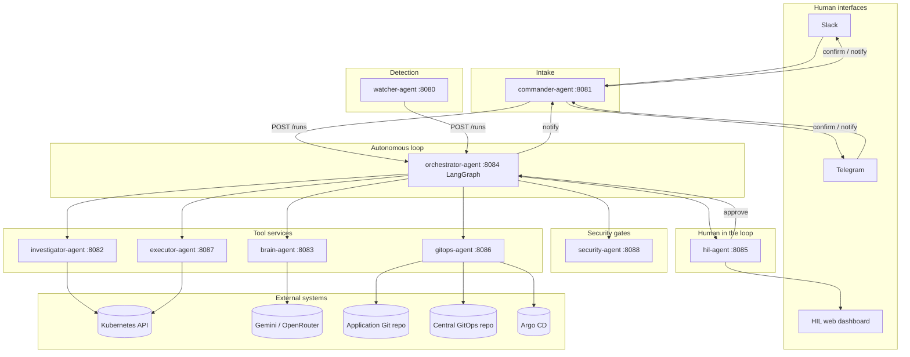
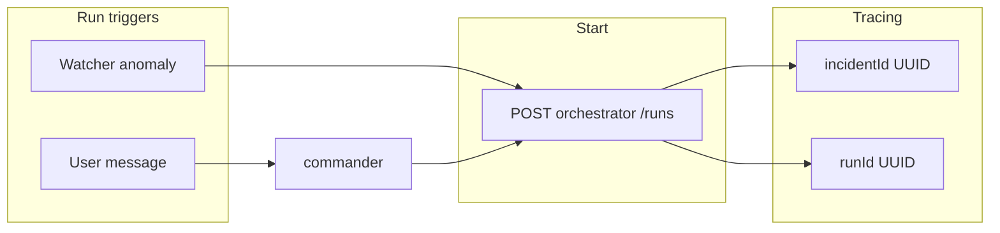
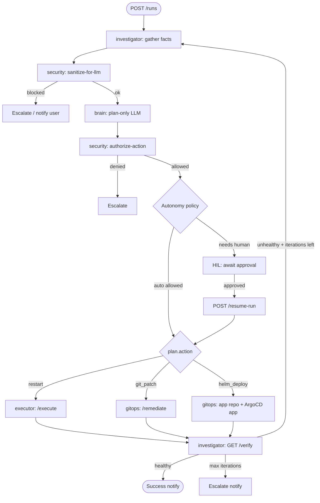
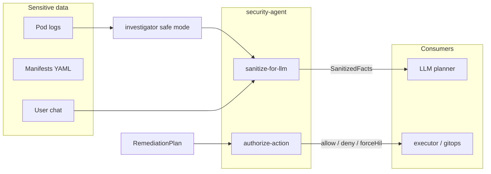
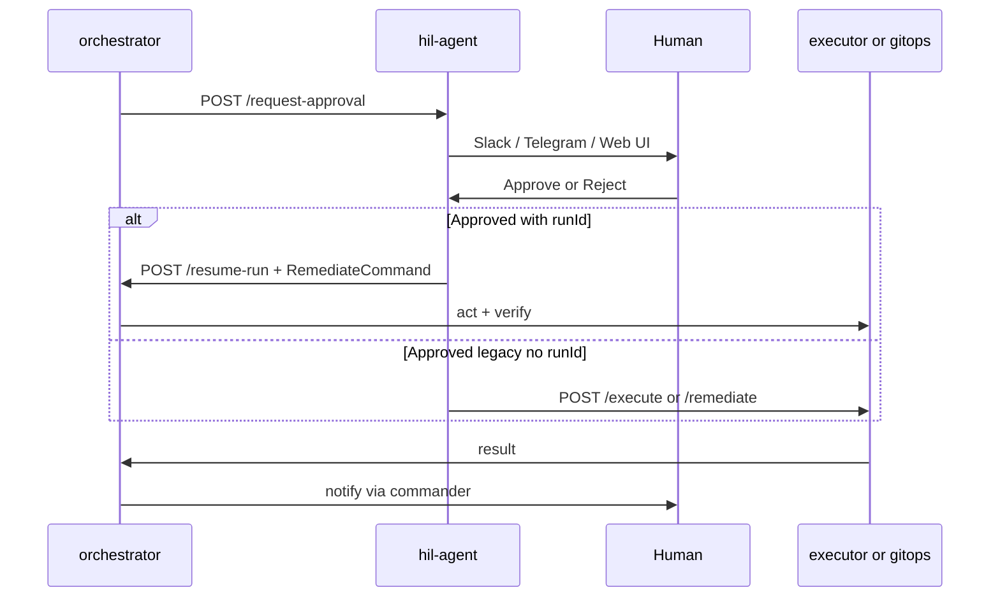
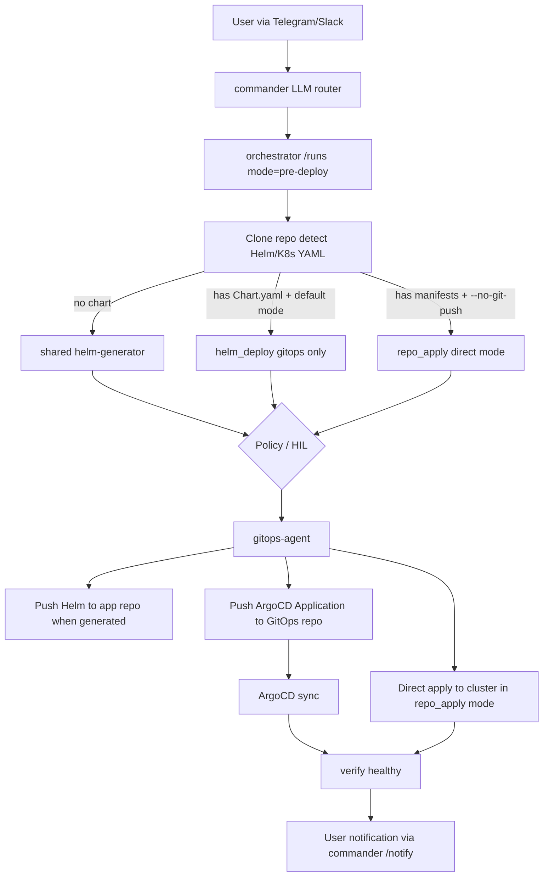
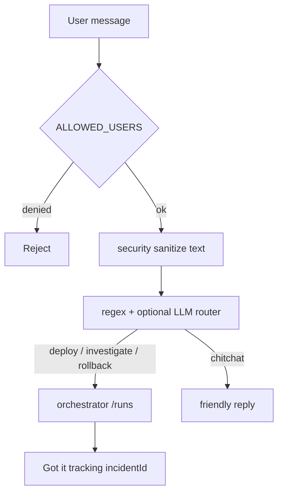
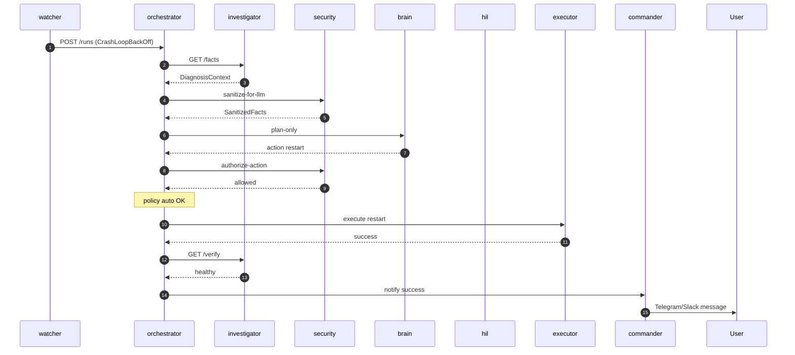

# SRE Bot — Architecture & Workflow

This document describes how the **Kube SRE Autonomous Agent Platform** is structured, how work flows through the system, and where human approval and security gates apply.

---

## 1. What this system does

The platform acts as an **SRE personal assistant** that can:

- **Detect** Kubernetes problems (crashes, OOM, mount failures, and similar events).
- **Investigate** by collecting structured cluster and Git facts (not raw `kubectl` dumps to the LLM).
- **Decide** on a remediation action: restart, GitOps patch, or Helm deploy.
- **Execute** changes through controlled tools (executor, gitops) after policy and optional human approval.
- **Verify** that the workload recovered, then **retry** with memory of what already failed.
- **Talk to you** on Slack or Telegram for commands, status, and outcomes.

The **orchestrator** runs a **LangGraph** state machine. Other agents are small HTTP microservices the graph calls as tools.

---

## 2. High-level architecture



**Design principle:** Only the orchestrator runs the full loop. Security is **deterministic** (not LLM-based). The LLM only **plans** on **sanitized** facts.

---

## 3. Agent catalog

| Agent | Port | Responsibility |
|-------|------|----------------|
| **watcher** | 8080 | Watches K8s Warning events and pod state; starts runs on anomalies (with cooldown). |
| **commander** | 8081 | Slack/Telegram intake, LLM-assisted routing, user notifications, remediation confirmations. |
| **investigator** | 8082 | Read-only K8s facts, `GET /facts`, `GET /verify`, `GET /app-review`, `GET /apps`, pre-deploy repo analysis. See [APP-GRAPH-DESIGN.md](./APP-GRAPH-DESIGN.md). |
| **brain** | 8083 | LLM planning (`POST /plan-only`); legacy path can still send plans to HIL. |
| **orchestrator** | 8084 | LangGraph loop: observe → sanitize → plan → authorize → policy → act → verify. |
| **hil** | 8085 | Approval store, Slack/Telegram approval buttons, web dashboard, resume after approve. |
| **gitops** | 8086 | JSON Patch to GitOps repo, Helm chart push to app repo, ArgoCD Application manifests. |
| **executor** | 8087 | Rollout restart (`restartedAt` annotation), rollout wait. |
| **security** | 8088 | `POST /sanitize-for-llm`, `POST /authorize-action`, audit events. |

Shared types and policy live in [`shared/`](../shared/).

---

## 4. Two ways a run starts



| Trigger | Source | Typical `mode` |
|---------|--------|----------------|
| Cluster event | watcher | `diagnose` |
| User command | commander | `diagnose`, `pre-deploy`, or `rollback` |

Every hop logs **`incidentId`** (and orchestrator runs use **`runId`**) for traceability.

---

## 5. Autonomous workflow (orchestrator loop)

This is the core behavior when `USE_ORCHESTRATOR=true` (default in Docker Compose).



### Restart-first policy

1. On transient symptoms (e.g. CrashLoopBackOff), the planner prefers **`restart`**.
2. If verify still fails, **`actionHistory`** includes `restart_failed` and the next plan favors **`git_patch`** or **`helm_deploy`**.
3. **`AUTONOMY_MAX_ITERATIONS`** (default 5) caps automatic retries.

### Action types

| Action | Executor | Effect |
|--------|----------|--------|
| `restart` | executor-agent | Patch Deployment/StatefulSet `restartedAt`, wait for rollout. |
| `git_patch` | gitops-agent | RFC 6902 patch → commit → push GitOps repo → ArgoCD sync. |
| `helm_deploy` | gitops-agent | Write Helm chart to **app repo** + register **Application** in GitOps repo. |
| `escalate_human` | — | No automated act; human must intervene. |

---

## 6. Security architecture (v1)



| Gate | When | Purpose |
|------|------|---------|
| **Minimize** | investigator | Smaller fact set; error-focused logs in safe mode; no Secret objects. |
| **Sanitize** | Before every LLM call | Redact secrets/PII; block on high-risk findings. |
| **Authorize** | Before every act | Allowlist actions, namespaces, patch paths, Helm safety rules. |
| **Policy** | After authorize | `AUTONOMY_MODE` decides auto vs HIL. |

See also: [OWASP LLM control matrix](./security/OWASP-LLM-control-matrix.md).

---

## 7. Human-in-the-loop (HIL)



- **First approve wins** across Slack, Telegram, and web (atomic store).
- If **`runId`** is present, HIL only resumes the orchestrator (avoids double execution).

---

## 8. Deploy workflow (user-initiated)

You can deploy from **Telegram** or **Slack** with a GitHub repo URL — with or without existing Kubernetes manifests.

**Examples**

```
/deploy github.com/org/my-app
deploy github.com/org/my-app @develop --namespace staging
Please ship https://github.com/org/bare-node-app to namespace default
/deploy github.com/bitnami/charts --namespace sandbox --no-git-push
```

**Conversational strategy selection (new):**

If deploy strategy is not explicitly provided, commander performs a repo findings pre-check and asks:
- `gitops` (push to Git + Argo CD)
- `direct` (no Git push, apply from source repo)
- `cancel`

On Telegram this is presented as **inline buttons** for one-tap selection.

**What happens**

| Input scenario | Bot behavior |
|---------------|--------------|
| Repo has no K8s/Helm manifests (default) | **Deterministic Helm scaffold** under `deploy/helm/<app>/`, pushed to the **app repo**, then Argo CD `Application` in the **GitOps repo** |
| Repo already has `Chart.yaml` (default) | Skips chart generation; registers Argo CD pointing at the existing chart path (no app repo writes) |
| Repo has plain YAML / Kustomize (default) | LLM plans `git_patch` for GitOps-managed manifests |
| Repo has manifests and request includes `--no-git-push` or "without git push" | Uses `repo_apply` action: clone source repo and apply directly via `helm`/`kubectl` without any Git write |



**Required env (deploy)**

| Variable | Purpose |
|----------|---------|
| `GITHUB_TOKEN` or `DEPLOY_APP_REPO_WRITE_TOKEN` | Push generated Helm chart to the application repo |
| `GITOPS_REPO_URL` | Central GitOps mirror for Argo CD Applications |
| `ARGOCD_URL` | Optional sync polling after push |
| `helm`, `kubectl` binaries in gitops-agent | Needed for direct `repo_apply` mode (`--no-git-push`) |
| `DIRECT_DEPLOY_DRY_RUN` (default `true`) | Run `helm --dry-run` / `kubectl --dry-run=server` before direct apply |

**Dual-repo deploy (default):**

1. **Application repo** — Helm chart under e.g. `deploy/helm/<app>/` (created when missing).
2. **Central GitOps repo** — ArgoCD `Application` pointing at that path and branch.

In **non-prod** namespaces, `helm_deploy` and `repo_apply` auto-execute under `AUTONOMY_MODE=low_risk_only`. Prod deploys still require HIL approval.

---

## 9. Commander (PA intake)



Commander does **not** remediate directly; it starts runs and delivers **confirm** / **notify** messages.

---

## 10. Persistence and state

| State | Where | Purpose |
|-------|--------|---------|
| **Run graph state** | LangGraph MemorySaver (dev) | Thread per `runId`; sanitized facts in checkpoint. |
| **Run records** | Postgres `sre_runs` (prod) | Transcripts, status, `pending_throttled` queue when namespace limit hit. |
| **Console sessions** | Memory or Redis | HTTP-only OIDC sessions; use Redis for multi-replica BFF. |
| **Approvals** | hil-agent in-memory store | Pending / approved / rejected. Optional namespace header enforcement. |
| **Circuit breaker** | `SREIncident` CRD (cluster) | `attemptCount`, `actionHistory`, escalation. |
| **GitOps mirror** | PVC / volume `gitops-mirror` | Persistent clone of central GitOps repo. |
| **Audit** | Logs + optional `SIEM_ENDPOINT` | Security and act events. |

---

## 11. Autonomy modes

| `AUTONOMY_MODE` | Behavior |
|-----------------|----------|
| `low_risk_only` | **Default.** Auto: `restart`, `helm_deploy`, `repo_apply` in non-prod. HIL: `git_patch`, prod deploy actions. |
| `full` | More actions without HIL; prod Helm / CRITICAL may still require HIL. |
| `hil_all` | Every act waits for human approval. |

Security can **force HIL** even in `full` mode via `forceHil` from authorize-action.

---

## 12. Legacy vs orchestrator path

| Setting | Behavior |
|---------|----------|
| `USE_ORCHESTRATOR=true` | watcher/commander → **orchestrator** (recommended). |
| `USE_ORCHESTRATOR=false` | investigator → **brain** → **hil** → **gitops** (original linear pipeline). |

---

## 13. Network map (Docker Compose)

All agents share the `sre-net` bridge. Host ports exposed for local dev:

| Service | Host port |
|---------|-----------|
| commander | 8081 |
| investigator | 8082 |
| brain | 8083 |
| orchestrator | 8084 |
| hil | 8085 |
| gitops | 8086 |
| executor | 8087 |
| security | 8088 |
| console | 8091 |
| platform | 8090 |

---

## 14. Compiler migration status

The codebase uses an **intent → plan → tool-call compiler** model:

- Planning produces `RemediationPlan` actions (brain or deterministic deploy planner).
- Orchestrator compiles to a **multi-step pipeline** via `compileAndValidatePlan()`:
  - optional `investigator.repo_inspect`
  - `executor.restart_workload` or `gitops.apply_plan`
  - `investigator.verify_health`
  - `commander.notify`
- **Plan-level + tool-level policy** gates run before execution.
- `executeCompiledPlan()` runs all steps with retries, idempotency keys, and a structured **transcript**.
- Transcripts persist in **Postgres** (default in Docker Compose), **Redis**, or **file** (`RUN_STORE_BACKEND`).
- Optional **capability planner** (`USE_CAPABILITY_PLANNER`) selects tools via `brain /plan-capability`.
- **Per-tool HIL** (`PER_TOOL_HIL`) can pause mid-pipeline; resume with `POST /resume-run` from HIL.
- Introspection:
  - `GET /tools` — tool catalog
  - `GET /runs` — list recent runs
  - `GET /runs/:runId` — status, compiled tools, full transcript, resume checkpoint

Roadmap: `docs/TOOL-COMPILER-ROADMAP.md` (Phases 1–4 complete)

Internal URLs use service names, e.g. `http://orchestrator-agent:8080`.

---

## 14. Related documents

- [README](../README.md) — Quick start and env vars  
- [PRODUCT-ROADMAP.md](./PRODUCT-ROADMAP.md) — Consolidated engineering backlog  
- [HOLMES-COMPARISON-AND-ADOPTION.md](./HOLMES-COMPARISON-AND-ADOPTION.md) — HolmesGPT vs sre-bot  
- [CONVERSATIONAL-UX-ROADMAP.md](./CONVERSATIONAL-UX-ROADMAP.md) — Chat UX  
- [CI-CODE-REMEDIATION-ROADMAP.md](./CI-CODE-REMEDIATION-ROADMAP.md) — CI/code fix phases  
- [DEEP-RCA.md](./DEEP-RCA.md) — Multi-source investigation stack  
- [OPERATIONS-CONSOLE.md](./OPERATIONS-CONSOLE.md) — Web UI  
- [secrets.example.yaml](../secrets.example.yaml) — Configuration template  
- [OWASP LLM control matrix](./security/OWASP-LLM-control-matrix.md) — Security controls  
- [policy/authorize.rego](../policy/authorize.rego) — OPA policies (v2)  

---

## 15. End-to-end sequence (incident example)



---

*Last updated to match the enterprise autonomous agent implementation (orchestrator + security + executor + dual-repo Helm).*
