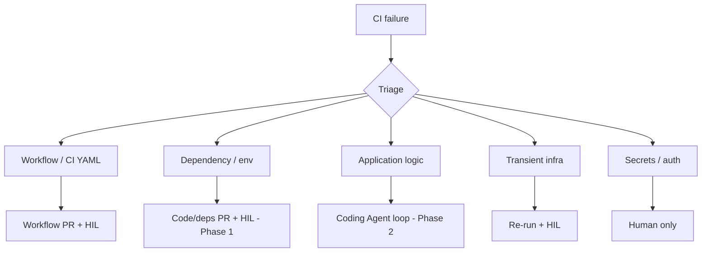
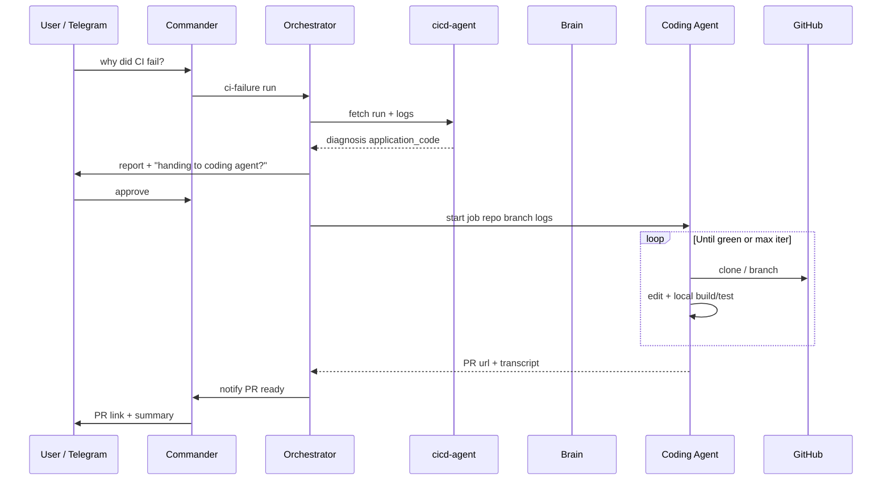

# CI / Code Remediation Roadmap

This document captures the evolution of sre-bot CI triage from **report-only** to **automated fixes**, including the **coding agent** pattern for complex application failures.

**Master backlog:** [PRODUCT-ROADMAP.md](./PRODUCT-ROADMAP.md) (Track C — **CI-1** through **CI-7**)

## Current state (shipped)

| Layer | Behavior |
|-------|----------|
| **cicd-agent** | Fetch GitHub Actions runs, logs, workflow paths |
| **ci-diagnose** | Categories: application code, workflow config, secrets, transient infra, **dependency/env** |
| **Telegram** | Category, guidance, error highlights, HIL for re-run / workflow PR |
| **Workflow PR** | Safe YAML patches (action version bumps) |
| **Phase 1 (this milestone)** | Missing-dependency detection → repo context → brain-proposed file patches → **code PR with HIL** |

## Problem classes

| Class | Example | Automation today | Target |
|-------|---------|------------------|--------|
| Workflow config | `checkout@v3` deprecated | Workflow PR | Same + more rules |
| Dependency / env | `ModuleNotFoundError: foo` | **Code PR (brain + HIL)** | + verify re-run |
| Application logic | Test assertion wrong | Report only | Coding agent |
| Transient | GitHub 500 on push | Re-run | Same |
| Secrets | Bad PAT / SSO | Escalate | Docs + checklist |

---

## Phase 1 — Dependency / env PR (implemented)

**Goal:** When CI fails because a dependency or install step is missing, the bot:

1. Classifies as `dependency_env` / `missing_dependency`
2. Fetches repo context (`package.json`, `requirements.txt`, `Dockerfile`, workflow snippet)
3. Calls **brain** `POST /plan-ci-fix` for a **small, reviewable patch** (add dep or install step)
4. Opens a **PR** via **cicd-agent** — only after **HIL approval**
5. Does **not** claim the build is green until a human merges and CI runs

**Limits (by design):**

- One PR with explicit file diffs; no unbounded edits
- Brain must return structured patches; invalid plans fall back to report-only
- No automatic merge

**Env:** `CI_CODE_FIX_ENABLED=true` (orchestrator), `GITHUB_TOKEN` with repo write for PRs.

---

## Phase 2 — Coding agent (recommended design)

### Your idea

> When the primary agent finds a **code issue**, hand off to a **coding agent** that explores the repo, fixes, runs build/tests in a loop, then returns control to **commander**.

### Assessment — is it a good idea?

**Yes, with guardrails.** It is the right long-term shape for “application code” failures, because:

- Regex triage cannot safely fix arbitrary logic bugs
- A dedicated agent with **repo checkout + test loop** matches how engineers actually fix CI
- Keeping it **separate** from commander/orchestrator avoids polluting the PA chat with long tool traces
- **HIL at PR boundary** (or max-iteration budget) keeps it enterprise-safe

**Risks to mitigate:**

| Risk | Mitigation |
|------|------------|
| Runaway cost / time | Max iterations, token budget, timeout per incident |
| Unsafe changes | Diff-only PR, security scan on patch, no force-push to main |
| Wrong repo branch | Always branch `sre-bot/fix-{incidentId}` |
| Flaky tests | Cap retries; escalate if same test fails 3× |
| Secrets in logs | Existing security sanitize pipeline |

**Recommendation:** Implement as a **separate worker** (`coding-agent` or Cursor/cloud agent SDK), not inside commander’s LLM thread.

### Proposed flow

### Coding agent responsibilities

1. **Input:** `CiRunFacts`, repo slug, branch, ranked runbooks from platform RAG (`POST /rag/query`)
2. **Workspace:** ephemeral clone (same pattern as investigator git-clone)
3. **Loop:** plan → edit → `npm test` / `pytest` / workflow-defined command → read output
4. **Output:** PR URL + short transcript for commander
5. **Stop conditions:** tests pass, max iterations, user cancel, security block

### Orchestrator integration

- New mode or sub-run: `ci-failure` + `plan.action === 'coding_agent_handoff'`
- New tool: `coding_agent.run_fix` (HTTP to coding-agent service)
- Commander message: “Code fix in progress (attempt 2/5)…”

### When *not* to invoke coding agent

- `dependency_env` with high-confidence single-file patch (Phase 1 is enough)
- `workflow_config` (workflow PR only)
- `transient_infra` (re-run only)
- `secrets_auth` (human)

---

## Phase 3 — Verify after fix ✅

After a code or workflow fix PR is opened:

1. `cicd-agent` watches the PR head branch (`POST /watch-pr-ci`)
2. Polls GitHub Actions until success, failure, or timeout
3. Commander notifies: ✅ CI passed or ❌ still failing
4. On success, orchestrator records outcome + triggers skills auto-write + RAG learn

**Env:** `CI_VERIFY_AFTER_PR=true`, `CI_VERIFY_INITIAL_DELAY_MS=45000`, `CI_VERIFY_POLL_MS=20000`, `CI_VERIFY_TIMEOUT_MS=1200000`

---

## Phase 4 — Custom / composite agents

For repos that build **custom agents** (Docker images, monorepos):

- **Skills:** pgvector runbooks — bootstrap via `sre-agent-platform/scripts/bootstrap_rag.py` or learn loop on verified CI fixes
- **Repo signals** in investigator: detect `agents/`, `Dockerfile`, `docker-compose` in workflow
- Coding agent uses skill as system appendix (already pattern in `skills-loader.ts`)

---

## Phase 5 — Webhook + proactive

Already partially shipped (`POST /webhooks/github`). Extend to:

- Auto-start `ci-failure` on failure
- Auto-start coding agent only when category = `application_code` and `CODING_AGENT_AUTO=false` default off

---

## Configuration summary

| Variable | Purpose |
|----------|---------|
| `CI_CODE_FIX_ENABLED` | Brain + code PR path for dependency_env |
| `CODING_AGENT_URL` | Phase 2 worker base URL |
| `CODING_AGENT_MAX_ITERATIONS` | Loop cap (default 5) |
| `CODING_AGENT_AUTO` | Auto-handoff without extra chat confirm (default false) |
| `SRE_RAG_GROUNDING` | Brain retrieves runbooks from pgvector before planning |
| `SRE_RAG_LEARNING` | Orchestrator upserts verified fixes into pgvector |
| `GITHUB_TOKEN` | Actions read + contents write + PRs |

---

## Action items (engineering backlog)

Tracked in [PRODUCT-ROADMAP.md](./PRODUCT-ROADMAP.md) Track C:

- [x] **CI-1** Phase 1: `dependency_env`, `/repo-context`, `/plan-ci-fix`, `cicd_code_pr`
- [x] **CI-2** Phase 2: `coding-agent` service + orchestrator handoff + console live panel + chat progress
- [x] **CI-3** Phase 3: post-PR CI verify + notify (`/watch-pr-ci`, polls PR branch CI)
- [ ] **CI-4** Phase 4: custom-agent skills templates
- [ ] **CI-5** Phase 5: webhook + proactive expansion
- [ ] **CI-6** Expand regex + LLM classifier for `go mod`, `cargo`, `pnpm`, Docker `RUN` failures
- [ ] **CI-7** Rate limits and per-repo allowlist for auto-PR

---

## Opinion summary

The **coding agent handoff** is a strong idea and fits this architecture: commander stays the PA, orchestrator stays the state machine, cicd-agent stays GitHub Actions–specific, and a **bounded fix loop** handles what Phase 1 cannot. Ship Phase 1 first for fast wins on missing dependencies; add the coding agent for true logic/test failures without blocking current users.
